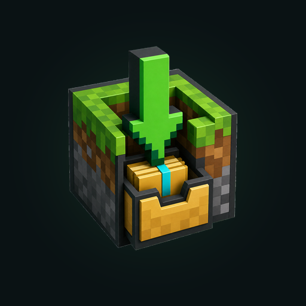

<p align="center">
  
</p>

<h1 align="center">BIX — Bedrock Import eXpress</h1>

<p align="center">A simple Android importer for Minecraft Bedrock add-ons, packs, ZIP downloads, folders, and worlds.</p>

<p align="center">
  <a href="https://github.com/Awetspoon/BIX-Bedrock-Importer/releases/latest"><strong>Download the latest BIX APK</strong></a>
</p>

## Download and install

1. Open the [latest BIX release](https://github.com/Awetspoon/BIX-Bedrock-Importer/releases/latest) on your Android phone.
2. Download `BIX.apk`.
3. Open the downloaded APK and allow install from your browser or file manager if Android asks.
4. Open BIX, choose your Bedrock file, ZIP, or extracted folder, then tap **Import with Minecraft**.

After BIX `1.1.4`, the app can also tell you when a newer GitHub release is available and open the download page for you.

## What BIX does

BIX is made for Minecraft Bedrock / Pocket Edition on Android.

It checks the Bedrock content you choose, prepares it when needed, then opens Minecraft so Minecraft can perform the final import.

For most downloads, choose **File / ZIP**. Choose **Extracted Folder** only when you already unzipped the add-on or world and can see `manifest.json` or `level.dat` inside.

This build has been checked against the current Bedrock Android update line, including the 26.32 hotfix released on 25 June 2026. BIX reads your installed Minecraft version from Android, so it is not tied to one hardcoded Minecraft version.

## Features

- Import Bedrock add-ons, behaviour packs, resource packs, and worlds
- Choose `.mcaddon`, `.mcpack`, `.mcworld`, `.zip`, or extracted folders
- Automatically detect and prepare the selected content
- Prepare separate behaviour/resource pack folders as a standard `.mcaddon`
- Import world folders as `.mcworld`
- Reject Java Edition content with a clear message
- Import without changing Minecraft to External storage mode
- Check GitHub Releases for BIX updates and open the latest release page

## Safe by design

BIX does not write into Minecraft's data, global resource, pack, or world folders.

Selected files are processed locally on your device. BIX gives Minecraft temporary read access only when you tap **Import with Minecraft**.

BIX uses internet access only to check whether a newer GitHub Release is available. It does not upload your selected add-ons, worlds, or folders.

## Not supported

Java Edition mods are not compatible with Minecraft Bedrock on Android. Files such as `.jar`, `pack.mcmeta`, `assets`, `data`, `META-INF`, or `net` are usually Java Edition content.

## Build APK on a laptop

For developers, open the repo in Android Studio, wait for Gradle sync, then use:

```text
Build > Build APK(s)
```

The debug APK will be created at:

```text
app/build/outputs/apk/debug/BIX.apk
```

## Build with GitHub Actions

Run:

```text
Actions > Build Debug APK
```

Get the artifact:

```text
BIX-debug-apk
```

## Notes

This app deliberately does not request access to Minecraft's data folders. Minecraft performs the final import itself.

The separate level-folder import does not require access to Minecraft's storage. It reads a folder selected by the user, packages its contents with `level.dat` at the archive root, and hands the generated `.mcworld` to Minecraft.

For Google Play preparation, signing and policy steps, see `PLAY_STORE_RELEASE.md` and `PRIVACY_POLICY.md`.

BIX is an independent utility and is not affiliated with, endorsed by, or sponsored by Mojang Studios or Microsoft.
